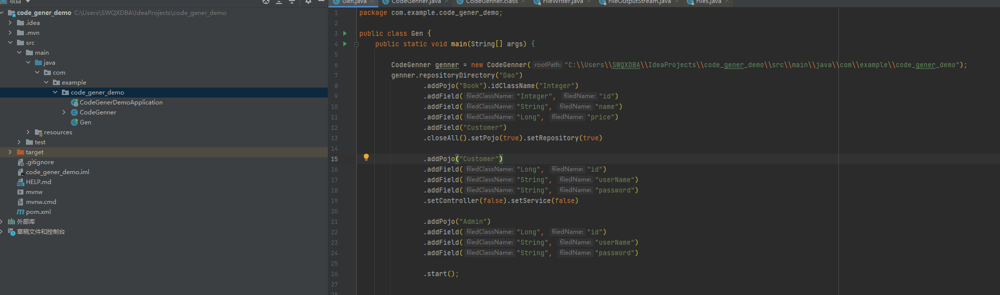
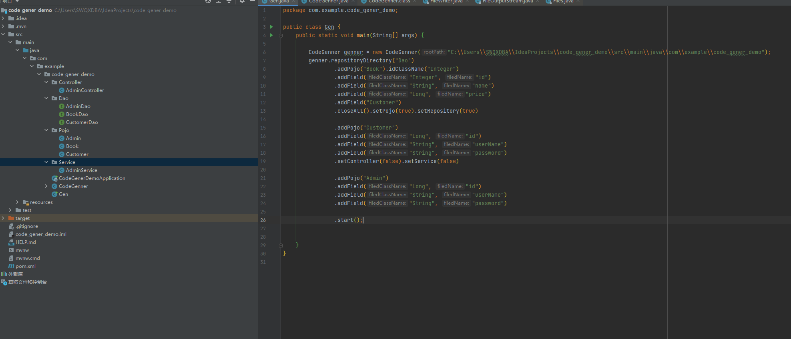
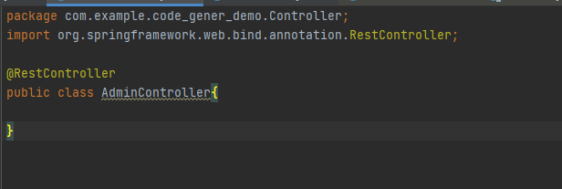
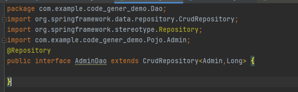
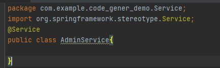

# my_mvc_code_genner

这个学期给人写了很多个课设后端， 为了快速搞定前期项目结构问题 写了这个生成器

* 为基于JPA的SpringBoot MVC写的代码生成器
* 生成器以实体类为入口 通过指定实体类的名称 类的属性 来进行对应的生成
* 生成实体类的四个文件 控制层 服务层 数据访问层 和 实体类定义
* 用于快速搭建项目文件框架
* 通过链式调用使用

  
比如
  
User.java UserController UserService UserRepository

类属性的设置不是必须的 你可以在创建后再自己写属性

## 案例 
最佳实践: 把生成器源码（CodeGenner）粘贴到Application同级目录下  然后在Application中运行生成

                //构造的时候需要指定生成路径的根目录 
                CodeGenner genner = new CodeGenner("C:\\Users\\SWQXDBA\\IdeaProjects\\my_mvc_code_genner\\src");

                //生成器会自动通过 this.getClass().getPackage().getName()来获取所在的包
                //如果你没有把生成器的源码放在根目录 则需要指定包名  比如  com.example.code_gener_demo; 
                //.setPackageName("com.example.code_gener_demo")

                //设置持久层文件夹名称 同时会修改生成的文件名 比如Repositoy/BookRepositoy.java -> Dao/BookDao.java
                //Service和Controller也可以进行设置 但都不是必须的 有默认的名字
                genner.repositoryDirectory("Dao")

                //增加一个实体类
                .addPojo("Book")

                //其中 idClassName决定了 JPA接口中的泛型参数 CrudRepository<Book,Integer> 如果不指定 默认为Long
                .idClassName("Integer")

                //增加一些类的属性 这些都是Book类的属性 其中id对应的属性应该第一个添加 因为会紧跟着   
                // @Id
                // @GeneratedValue(strategy = GenerationType.IDENTITY) 的后面
                //第一个参数是属性的类名 第二个是属性名
                .addField("Integer", "id")
                .addField("String", "name")
                .addField("Long", "price")
                //不指定类属性名 默认以属性类名首字母小写作为属性名 比如Customer customer
                .addField("Customer")

                //clossAll()表示该类的所有文件都不进行生成 然后设置只生成Book.java和BookDao.java
                .closeAll().setPojo(true).setRepository(true)

                .addPojo("Customer")
                .addField("Long", "id")
                .addField("String", "userName")
                .addField("String", "password")

                //默认会生成类的四个文件 这里取消了两个 只生成Customer.java CustomerDao.java
                .setController(false).setService(false)

                .addPojo("Admin")
                .addField("Long", "id")
                .addField("String", "userName")
                .addField("String", "password")
                //生成了该类的四个文件 Admin.java AdminDao.java AdminController.java AdminService.java

                //启动
                .start();

把项目下载到本地后打开README.md来查看图片

生成前

生成后

生成会写入基本的包和注解

请确保把Id作为第一个添加的属性 如 .addPojo("Admin").addFiled("Long","id")

由此来保证@Id 下跟着的是Id

